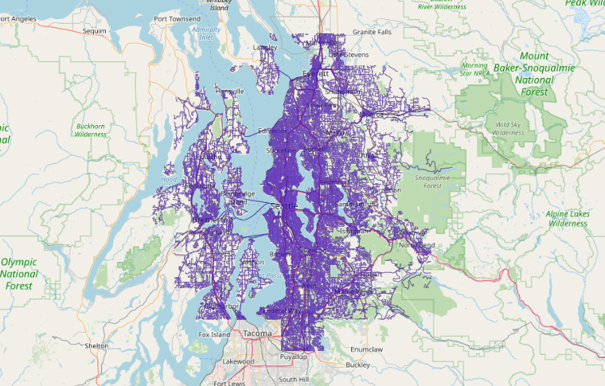
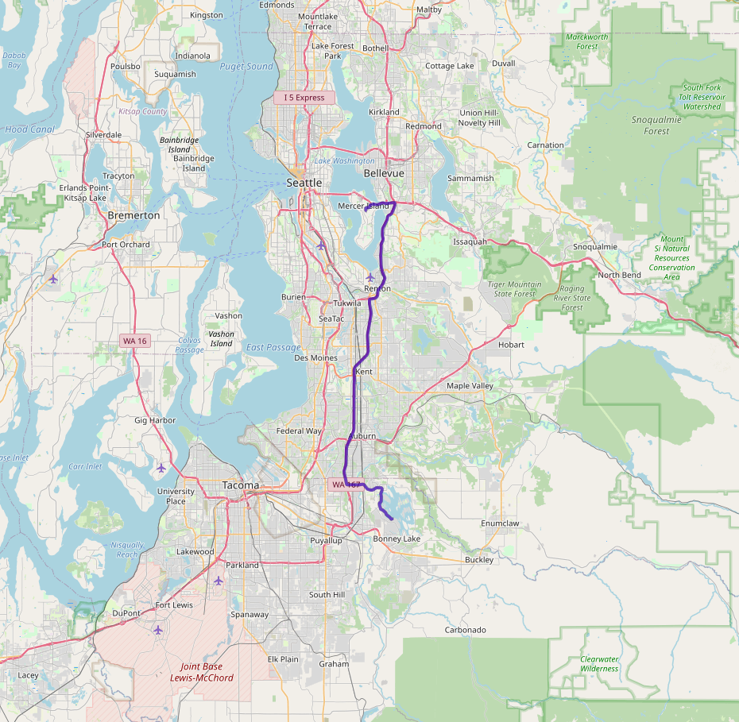

# Shortest path with Kinetica
This guide shows how to use Kinetica's graph API to the shortest routes between different points in Seattle. The entire exercise is done using SQL. There are three types of routes that we solve - single source to single destination, a single source to many destinations and many sources to many destinations.

The instructions are provided within the workbook itself. So the fastest way to try this out would be to download the workbook json file (guide-graph_shortest_path.json) and import it into Kinetica.

## Getting started
Click below👇🏼 for a quick walkthrough on how to import a workbook into Kinetica.

[](https://app.getreprise.com/launch/m6Ed20y/)

If you are unfamiliar with Kinetica's graph API you can learn more about it [here](https://docs.kinetica.com/7.1/graph_solver/network_graph_solver) or this [course playlist](https://www.youtube.com/playlist?list=PLtLChx8K0ZZVkufn1GMvsR3BY2jMP3JXD)

If you don't have Kinetica installed and running, please follow the [Getting Started](https://github.com/kineticadb/kinetica-workbooks#-getting-started-with-kinetica) section to get everything setup to run this guide

## Step 1 - Get the data into Kinetica
In this section we will load the seattle road network data into Kinetica.

### Create the data source
The data for this guide is stored in a publicly accessible AWS S3 bucket. Our first task is to create a [data source](https://docs.kinetica.com/7.1/concepts/data_sources/) that points to this bucket.

```
CREATE OR REPLACE DATA SOURCE guides_data
LOCATION = 'S3'
WITH OPTIONS (
    ANONYMOUS = 'true',
    BUCKET NAME = 'guidesdatapublic',
    REGION = 'us-east-1'
)
```

### Load the data into Kinetica
Once a data source is defined we can start loading data from the data source into Kinetica.

This guide uses the seattle_roads csv file. The road weights data provides information on the time taken to travel different road segments in Seattle. We will use this information to compute the shortest path between different points in terms of travel time.

```
LOAD DATA INTO seattle_roads
FROM FILE PATHS 'seattle_roads.csv'
FORMAT TEXT 
WITH OPTIONS(
    DATA SOURCE = 'guides_data'
)
```


> **NOTE**: Kinetica uses [schema](https://docs.kinetica.com/7.1/concepts/schemas/) namespaces to organize tables. Tables are by default created in the ki_home schema in Kinetica. You can explicitly specify a particular schema using the syntax `<schema_name>.<table_name>`.

## Step 2 - Explore the data
The road weights data contains geo spatial information on the Seattle Road Network.

```
SELECT * 
FROM ki_home.seattle_roads
LIMIT 5
```
| OriginalEdgeID | TwoWay | WKTLINE                                                                             | time       |
|----------------|--------|-------------------------------------------------------------------------------------|------------|
| 884148400426   | 0      | LINESTRING (-122.141929864883 47.5814411044121, -122.142208814621 47.5816503167152) | 2.81593227 |
| 884148400427   | 0      | LINESTRING (-122.142849862576 47.5879803299904, -122.142828404903 47.5873097777367) | 4.47476864 |
| 884148400427   | 0      | LINESTRING (-122.142828404903 47.5873097777367, -122.142839133739 47.5868001580238) | 3.40037513 |
| 884148400427   | 0      | LINESTRING (-122.142839133739 47.5868001580238, -122.142849862576 47.586470246315)  | 2.20160294 |
| 884148400428   | 0      | LINESTRING (-122.142798900604 47.5890210270882, -122.142839133739 47.5885891914368) | 2.88676238 |


The network is broken into small road segments with the following information for each segment. Each LINESTRING in the table above corresponds to a small road segment. The column descriptions are below
1. OriginalEdgeID - Unique identifier for each road segment
2. TwoWay - 0 indicates one way and 1 indicates a two way edge
3. WKTLINE - The WKT Linestring that represents each road segment geo spatially.
4. time - This is the time that it would take to traverse each segment.

The map slice below shows the WKT Linestrings on a map for a visual representation of the same data.



## Step 3 - Create the graph
In this step we will convert the road network data into a graph. Each road segment in the data will be represented as an edge on the graph. Each road segment has an associated direction and a weight. So we end up with a weighted directed graph of the Seattle road network.

### Creating graphs in Kinetica
Graphs in Kinetica can have 4 components - nodes, edges, weights and restrictions. The primary task when creating a graph is to use the data at hand to accurately identify the required components for creating the graph.

The two videos below give a quick introduction to creating graphs in Kinetica
- https://youtu.be/ouZb00xEzh8
- https://youtu.be/oLYIPBRteEM

The different identifier combinations for each component are listed [here](https://docs.kinetica.com/7.1/graph_solver/network_graph_solver/#identifier-combinations).

### Picking the right identifier combination
Graphs in Kinetica are created using the [`CREATE GRAPH`](https://docs.kinetica.com/7.1/sql/graph/#create-graph) statement.

We will be using the `WKTLINE` and the `TwoWay` columns to specify the edge component. 

The data provides a column that specifies the `time` taken to traverse a particular road segment. We will specify this as the weight for each edge. This means that when we try to find the shortest path between two points we want to minimize the time it takes to traverse the different road segments in that path. The weights are matched to the edges using the same columns as the edges component.

```
CREATE OR REPLACE DIRECTED GRAPH GRAPH_S (
    EDGES => INPUT_TABLE(
        SELECT
            WKTLINE AS EDGE_WKTLINE,
            TwoWay AS EDGE_DIRECTION
        FROM
            ki_home.seattle_roads
    ),
    WEIGHTS => INPUT_TABLE(
        SELECT
            WKTLINE AS WEIGHTS_EDGE_WKTLINE,
            TwoWay AS WEIGHTS_EDGE_DIRECTION,
            time AS WEIGHTS_VALUESPECIFIED
        FROM
            ki_home.seattle_roads
    ),
    OPTIONS => KV_PAIRS(
        'recreate' = 'true',
        'enable_graph_draw' = 'true',
        'graph_table' = 'seattle_graph_debug'
    )
)
```

> If you are on a version of Kinetica that is 7.1.6 or above, the same query can be written as shown below. This allows us to specify the weight directly in the edge specification using the `WEIGHT_VALUESPECIFIED` argument.

```
CREATE OR REPLACE DIRECTED GRAPH GRAPH_S (
    EDGES => INPUT_TABLE(
        SELECT
            WKTLINE AS WKTLINE,
            TwoWay AS DIRECTION,
            time AS WEIGHT_VALUESPECIFIED
        FROM
            ki_home.seattle_roads
    )
)
```

## Step 4 - Solve the graph
There are three different route combinations that we would like to solve.
1. One source to one destination
2. One souurce to many destinations
3. Many sources to many destination.

Let's take each one at a time.

### Set the source and destination points
For our first route combination we start with one source - `POINT(-122.1792501 47.2113606)` - to one destination point - `POINT(-122.2221 47.5707)`. We will create two tables to store these source and desination points.


```
CREATE OR REPLACE TABLE seattle_sources (wkt WKT NOT NULL);

INSERT INTO ki_home.seattle_sources 
VALUES ('POINT(-122.1792501 47.2113606)');

CREATE OR REPLACE TABLE seattle_dest (wkt WKT NOT NULL);

INSERT INTO ki_home.seattle_dest
VALUES ('POINT(-122.2221 47.5707)')
```

### One to one
Kinetica supports the creation and [execution](https://docs.kinetica.com/7.1/sql/udf/#sql-execute-function) of User Defined Functions in SQL. [`SOLVE_GRAPH`](https://docs.kinetica.com/7.1/sql/graph/#sql-graph-solve) is a function that can be executed either within a SELECT statement as a table function or within an EXECUTE FUNCTION call. We will use the latter.

```
EXECUTE FUNCTION SOLVE_GRAPH(
    GRAPH => 'GRAPH_S',
    SOLVER_TYPE => 'SHORTEST_PATH',
    SOURCE_NODES => INPUT_TABLE(SELECT ST_GEOMFROMTEXT(wkt) AS NODE_WKTPOINT from seattle_sources),
    DESTINATION_NODES => INPUT_TABLE(SELECT ST_GEOMFROMTEXT(wkt) AS NODE_WKTPOINT from seattle_dest),
    SOLUTION_TABLE => 'GRAPH_S_ONE_ONE_SOLVED'
)
```

The solutions table provides the route for the shortest path and its associated costs.

```
select * from ki_home.GRAPH_S_ONE_ONE_SOLVED
```
| SOLVERS_NODE_ID | SOLVERS_NODE_COSTS | wktroute                                                                                |
|-----------------|--------------------|-----------------------------------------------------------------------------------------|
| 123191          | 2437.28491         | LINESTRING (-122.179250121117 47.2113606333733, -122.178909480572 47.210411131382, ...) |


You can easily visualize the route on workbench as shown below.




### One to many
Next we want to find the shortest path from the same source point to multiple desination points. Let's update the destination table to add these additional points.

```
INSERT INTO ki_home.seattle_dest
VALUES
('POINT(-122.541017 47.809121)'), 
('POINT(-122.520440 47.624725)'),
('POINT(-122.467915 47.427280)')
```

The only change we need to make to our previous code, now is the name of the solution table.

```
EXECUTE FUNCTION SOLVE_GRAPH(
    GRAPH => 'GRAPH_S',
    SOLVER_TYPE => 'SHORTEST_PATH',
    SOURCE_NODES => INPUT_TABLE(SELECT ST_GEOMFROMTEXT(wkt) AS NODE_WKTPOINT from seattle_sources),
    DESTINATION_NODES => INPUT_TABLE(SELECT ST_GEOMFROMTEXT(wkt) AS NODE_WKTPOINT from seattle_dest),
    SOLUTION_TABLE => 'GRAPH_S_ONE_MANY_SOLVED'
)
```

The solution table lists each route from the source point to the 4 destination points.
```
select * from ki_home.GRAPH_S_ONE_MANY_SOLVED
```

| SOLVERS_NODE_ID | SOLVERS_NODE_COSTS | wktroute                                                                                |
|-----------------|--------------------|-----------------------------------------------------------------------------------------|
| 123191          | 2437.28491         | LINESTRING (-122.179250121117 47.2113606333733, -122.178909480572 47.210411131382, ...) |
| 394364          | 5420.33936         | LINESTRING (-122.179250121117 47.2113606333733, -122.178909480572 47.210411131382, ...) |
| 84273           | 4786.78809         | LINESTRING (-122.179250121117 47.2113606333733, -122.178909480572 47.210411131382, ...) |
| 285636          | 4144.87793         | LINESTRING (-122.179250121117 47.2113606333733, -122.178909480572 47.210411131382, ...) |


### Many to many
The third example illustrates a shortest path solve from two source nodes to four destination nodes. For this example, there are two starting points `(POINT(-122.1792501 47.2113606)` and `POINT(-122.375180125237 47.8122103214264))` and paths will be calculated from the first source to two different destinations and from the second source to two other destinations. When many source nodes and many destination nodes are provided, the graph solver pairs the source and destination node by list index and calculate a shortest path solve for each pair. So the first point in the solver list is paired with the first in the destination so on and so forth.

Let's add these additional values to the source table. Note that we don't need to update the destination table since it already contains the 4 destination nodes.

```
INSERT INTO ki_home.seattle_sources 
VALUES
('POINT(-122.1792501 47.2113606)'), 
('POINT(-122.375180125237 47.8122103214264)'),
('POINT(-122.375180125237 47.8122103214264)');
```

The only thing to update in our solver function is the name of the solution table.
```
EXECUTE FUNCTION SOLVE_GRAPH(
    GRAPH => 'GRAPH_S',
    SOLVER_TYPE => 'SHORTEST_PATH',
    SOURCE_NODES => INPUT_TABLE((SELECT ST_GEOMFROMTEXT(wkt) AS NODE_WKTPOINT from seattle_sources)),
    DESTINATION_NODES => INPUT_TABLE((SELECT ST_GEOMFROMTEXT(wkt) AS NODE_WKTPOINT from seattle_dest)),
    SOLUTION_TABLE => 'GRAPH_S_MANY_MANY_SOLVED'
)
```

Table shows the 4 routes from the two source points to two different destinations and the associated costs.

```
select * from ki_home.GRAPH_S_MANY_MANY_SOLVED
```

| INDEX | SOURCE                                     | TARGET                                     | COST       | PATH                                                                                     |
|-------|--------------------------------------------|--------------------------------------------|------------|------------------------------------------------------------------------------------------|
| 2     | POINT (-122.375180125237 47.8122103214264) | POINT (-122.520979642868 47.6248607039452) | 3066.91699 | LINESTRING (-122.375180125237 47.8122103214264, -122.375818490982 47.8124490380287, ...) |
| 3     | POINT (-122.375180125237 47.8122103214264) | POINT (-122.471138834953 47.4291801452637) | 3642.271   | LINESTRING (-122.375180125237 47.8122103214264, -122.375818490982 47.8124490380287, ...) |
| 0     | POINT (-122.179250121117 47.2113606333733) | POINT (-122.221578061581 47.5709509849548) | 2440.33984 | LINESTRING (-122.179250121117 47.2113606333733, -122.178909480572 47.210411131382, ...)  |
| 1     | POINT (-122.179250121117 47.2113606333733) | POINT (-122.541549503803 47.8095200657845) | 5418.5498  | LINESTRING (-122.179250121117 47.2113606333733, -122.178909480572 47.210411131382, ...)  |


